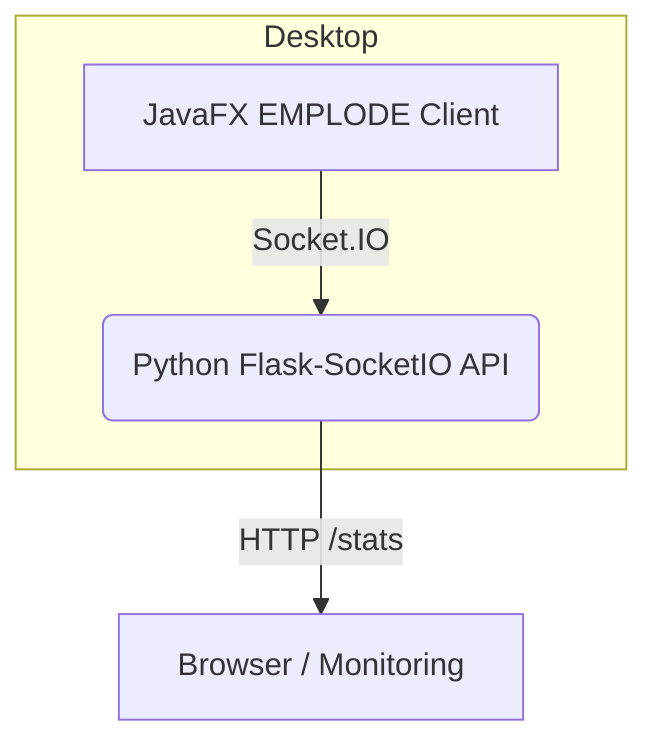

# EMPLODE – burst your thoughts

Minimal multiplayer emoji-explosion playground powered by a **Python Flask-SocketIO** backend and a **JavaFX Desktop** client.

---

## 1. Requirements

### Python (backend)
```
python -m pip install -r requirements.txt
```

### Java (client)
* JDK 17+
* Gradle 8+ (or use the Gradle wrapper once generated).

---

## 2. Running the game

### 2.1 Launch the server
```
python backend/emoji_server.py
```
The server listens on **`http://localhost:3000`** and exposes one REST endpoint `/stats` plus full Socket.IO support.

### 2.2 Launch the client
```
cd client
gradle run        # or ./gradlew run (once wrapper is generated)
```
The JavaFX window will open; click the mint-coloured circle up to ten times to trigger a local & network-wide emoji burst.

---

## 3. Architecture overview


* **emoji_server.py** – keeps global game state, leaderboards, and broadcasts events.
* **JavaFX client** – renders the central shape & particles; communicates via Socket.IO.
* Styling inspired by **sics-ground**: dark canvas, mint/pink neon accents, JetBrains Mono font.

---

## 4. TODO
* Render particle burst in JavaFX.
* Build leaderboard overlay & remote players' clicks.
* Generate Gradle wrapper for easier builds.
* Package server & client into cross-platform installers. 